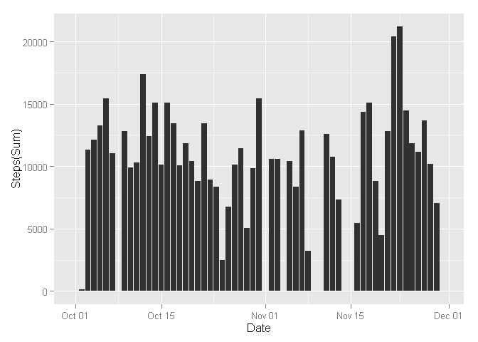
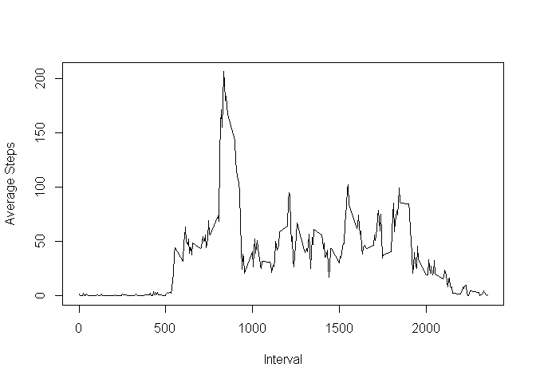
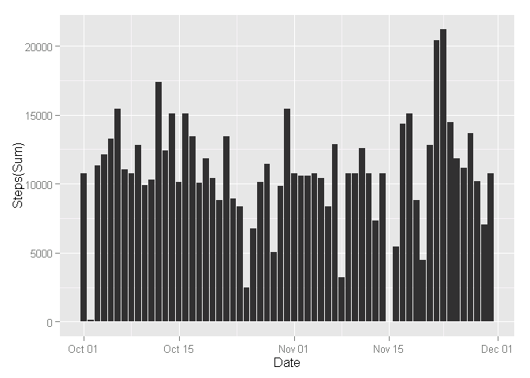
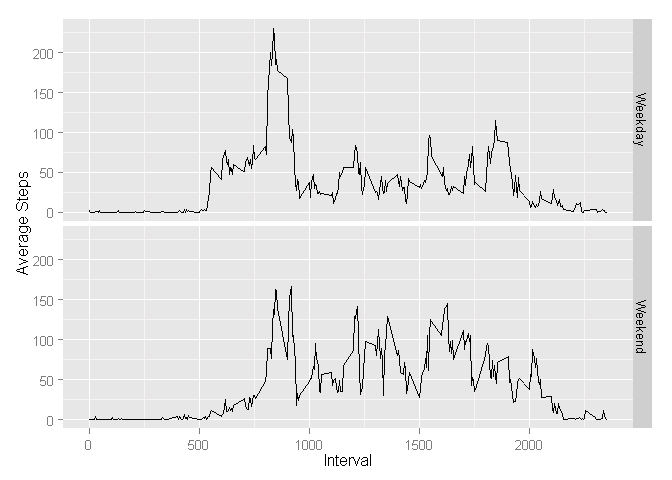

# Reproducible Research: Peer Assessment 1


```r
library(knitr)
opts_chunk$set(fig.path='figures/')
```

```r
## Loading and preprocessing the data
library(data.table)
library(ggplot2)
setwd("C:\\GTemp\\R\\RepData_PeerAssessment1")
df <- read.csv(".\\activity\\activity.csv")
dt <- data.table(df)
dt$date <- as.Date(dt$date)
#dt[is.na(dt[,steps]),1] <- 0 
s_d <- dt[, sum(steps,na.rm=TRUE),by = date]


## What is mean total number of steps taken per day?
ggplot(s_d,aes(x=s_d$date,y=V1))+ geom_bar(stat='identity',aes_string(x=NULL)) + xlab("Date") + 
        ylab("Steps(Sum)") +
        scale_x_date()
```

 

```r
## What is the average daily activity pattern?
mn <- mean(s_d$V1,na.rm=TRUE)
md <- median(s_d$V1,na.rm=TRUE)
```

mean/median by date 9354.2295082 and 10395. 

## the average daily activity pattern

```r
mn_i <- dt[, mean(steps,na.rm=TRUE),by = interval]
setnames(mn_i,"V1","Average_Steps")
plot(mn_i$interval,mn_i$Average_Steps,type="l",xlab="Interval",ylab="Average Steps")
```

 

## 5-minute interval with the maximum number of steps

```r
mn_i[which.max(mn_i$Average_Steps),]
```

```
##    interval Average_Steps
## 1:      835      206.1698
```


## Imputing missing values

```r
totalNA <- nrow(dt[is.na(dt[,steps]),])
```
## the total number of rows with NAs is 2304


```r
getNAMean <- function(idate,steps){
        if(!is.na(steps)){
                return (steps)
        }else{
                return (mn_d[date==idate,Average_Steps])        
        }        
}
getNAMeanIterval <- function(inInterval,steps){
        if(!is.na(steps)){
                return (steps)
        }else{
                return (mn_i[interval==inInterval,Average_Steps])        
        }        
}
#3. Create a new dataset that is equal to the original dataset 
#but with the missing data filled in.
dt2 <- df
dt2$steps <- mapply(getNAMeanIterval,dt2$interval,dt2$steps)
#4. Make a histogram of the total number of steps taken each day 
#   and Calculate and report the mean and median total number of steps taken per day. 
#   Do these values differ from the estimates from the first part of the assignment? 
#   What is the impact of imputing missing data on the estimates of the total daily 
#   number of steps?
dt2 <- data.table(dt2)
dt2$date <- as.Date(dt2$date)
s_d2 <- dt2[, sum(steps,na.rm=TRUE),by = date]
ggplot(s_d2,aes(x=s_d2$date,y=V1)) + geom_bar(stat='identity') +
         xlab("Date") + 
        ylab("Steps(Sum)") +
        scale_x_date()
```

 

```r
mn2 <- mean(s_d2$V1,na.rm=TRUE)
md2 <- median(s_d2$V1,na.rm=TRUE)
```
## mean/median by date after imputing miss values:  1.0766189\times 10^{4} and 1.0766189\times 10^{4}. 

## Are there differences in activity patterns between weekdays and weekends?

```r
#Create a new factor variable in the dataset with two levels -- "weekday" 
#and "weekend" indicating whether a given date is a weekday or weekend day.
getWeekday <- function(idate){
        if(weekdays(idate) =="Saturday" || weekdays(idate) =="Sunday"){
                return ("Weekend")
        }else{
                return ("Weekday")
        }
}
dt3 <- dt2
dt3$Days <- mapply(getWeekday,as.Date(dt3$date))
mn_dt3 <- dt3[, mean(steps,na.rm=TRUE),by = c("interval","Days")]
setnames(mn_dt3,"V1","Average_Steps")
ggplot(mn_dt3,aes(interval,Average_Steps)) + geom_line()+ facet_grid(Days ~ .) +
        xlab("Interval") +
        ylab("Average Steps")
```

 
